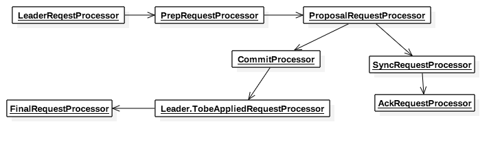
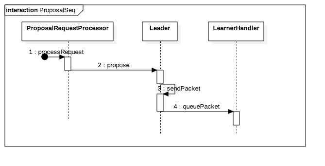
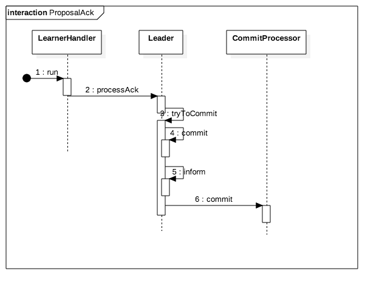

# 响应客户端请求
继续上一章处理client连接的流程。继续以NettyServerCnxn.receiveMessage为例，该接口会调用ZooKeeperServer.processPacket，而processPacket内部会调用submitRequest，最后submitRequest会将Request派发到firstProcessor.

在Zookeeper架构一章已经简单介绍了，Zookeeper不同的角色的节点通过创建不同的Processors链表来处理客户端请求。

## 1. 配置Processors

###1.1 Follower节点配置Processors

Follower节点配置Processors详见FollowerZooKeeperServer.setupRequestProcessors, 链表结构如下:

### 1.2 Leader节点配置Processors
Leader节点配置Processors详见LeaderZooKeeperServer.setupRequestProcessors, 链表结构如下:

### 1.3 客户端请求处理
Zookeeper将客户端的请求实际上分为两种类型。第一种类型的请求可以叫做读请求，如getData，getChildren等。这种类型的请求不会修改zookeeper数据库的内容，因为zookeeper每个节点的数据库内容是一致的(不同的节点之间由于同步的时间不一致，可能会导致数据有不一致)，所以读请求只用在本地节点的数据库即可。第二种节点会修改数据库内容，如create,delete等。非Leader节点接收到此种请求，会先转发到Leader节点，Leader会按照先Proposal，后Commit的方式将请求同步到所有节点。

## 2. 处理请求流程
处理请求的核心就是如何将写操作同步到所有服务器，所以本章主要讲述写操作各个服务器的交互。
### 2.1 Leader处理请求流程
1.2节介绍了Leader的Processors链表结构，请求的流向和链表的结构一致，下面介绍每个Processor所做的工作。

#### LeaderRequestProcessor
* 如果是LocalSession，并且用户请求为创建临时节点（Session关闭时节点会删除），则升级Session到GlobalSession，并且创建一条createSession请求（upgradeRequest）。
* 如果createSession请求不为null，转发到PrepRequestProcessor。
* 转发用户请求到PrepRequestProcessor

#### PrepRequestProcessor
PrepRequestProcessor设置Request的transcation信息，该Processor运行于独立的线程中。对于会改写zookeeper数据库的操作，该Processor会添加transcation信息，并且增加TxnHeader。对于读操作，则只检查session合法性。

#### ProposalRequestProcessor
* ProposalRequestProcessor会先将请求派发给CommitProcessor
* 随后ProposalRequestProcessor检查哪些请求被添加了transcation信息，如果被添加了transcation信息，则会发送Proposal包给集群内所有节点。发送Proposal的时序图如下:
* 发送完Proposal之后，再将该请求发送到SyncRequestProcessor。

#### SyncRequestProcessor
SyncRequestProcessor用于存储请求Transcation日志以及数据库的Snapshot日志到文件，存储的逻辑详见run函数：

* 定义了snapCount用来控制多少次请求生成一个新的Transcation日志文件和保存Snapshot文件。
* 为了防止不同的节点都在相同的时间点存储日志，每个节点真正控制生成文件的请求次数为snapCount/2 + rand.nextInt(snapCount/2)
* Transcation日志格式以及Snapshot文件格式详见数据库格式。

#### AckRequestProcessor
在SyncRequestProcessor存储日志之后，AckRequestProcessor仅仅是发送一个正在处理请求的ACK到Leader自己，用来模拟收到Leader节点的ACK。

#### Leader Proposal ACK管理
LearnerHandler在完成选举之后，会调用startSendingPackets来启动发送Packet的线程，同时进入接收该节点返回数据的循环。
在收到Proposal Packet的ACK后，LearnerHandler处理流程为：

1. LearnerHandler接收数据线程主函数
2. 接收到节点所发的Proposal ACK数据，调用Leader.processAck
3. 将ACK的节点id添加到Proposal数据中，调用tryToCommit,尝试Commit该Request。
4. 调用Proposal.hasAllQuorums检查ACK的节点是否超过集群数量一半(包括Leader本身)，若超过，则向所有Follower发送Commit。
5. 向所有Observer节点发送Inform。
6. 通知CommitProcessor该请求已Commit。

#### CommitProcessor
CommitProcessor用于管理Session需要Commit的请求，该Processor Leader和Follower节点共用，CommitProcessor有自己的运行线程。

* 接收到Request后，若该Request需要Commit，或者该Session中存在pendingRequest,则将该Request添加到对应Session的pendingRequest中。否则，直接将Request发送给下一个Processor。该处理方法能保证同一个Session 处理Request的顺序，例如该Session先发送了一个修改数据库的操作，又发送一个读数据库的操作，读的操作肯定会在写操作之后。
* CommitProcessor收到某个Request已经Commit之后，（如上，Leader将Commit发送给Follower之后，或者Follower接收到Leader发送的Commit），将Commit的请求转发给下一个Processor。Follower和Leader都有两种Commit的请求。
  * Follower Commit请求类型
      * 自己节点上的Session发送的修改数据库的请求。此种情况下，该Session对应的pendingReqeust的第一个Request肯定是Commit请求；
      * 或者是Leader发送的其他节点接收到的修改数据库的请求，此种情况无对应的pendingRequest，触发入口来自Follower.processPacket。
  * Leader Commit请求类型
      * 自己节点上Session发送的修改数据库请求。
      * Follower节点转发的，但是处理流程和自己节点上接收到的一样，触发入口来自LearnerHander.run调用LeaderZooKeeperServer.submitLearnerRequest。
* CommitProcessor将已经Commit的Request发送给下一个Processor，并且将该Session上pendingRequest随后的读请求转发给下一个Processor。

#### Leader.TobeAppliedRequestProcessor
在Commit Request之前，Leader会记录已Commit但未修改到数据库的写操作Proposal，该记录用于Follower和Leader选举之后的同步数据，详细细节等分析日志格式时再详细介绍。本Processor的作用就是在操作数据库之前清除保存的Proposal信息。

#### FinalRequestProcessor
FinalRequestProcessor是操作数据库来响应对应的读或写操作。

### 2.2 Follower处理请求流程
CommitProcessor和FinalRequestProcessor前面已说明，所以此处只用介绍FollowerRequestProcessor。
#### FollowerRequestProcessor
FollowerRequestProcessor运行于独立的线程中。主要工作如下:
* 提交Request时，如果Request是local session，且创建了临时节点，则升级session到Global类型，并且插入一个createSession request。
* 将Request转发到CommitProcessor。
* 如果为写请求，转发到Leader。
     
 

