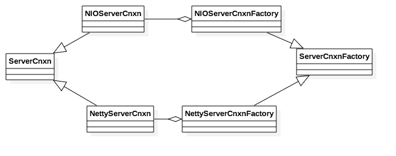
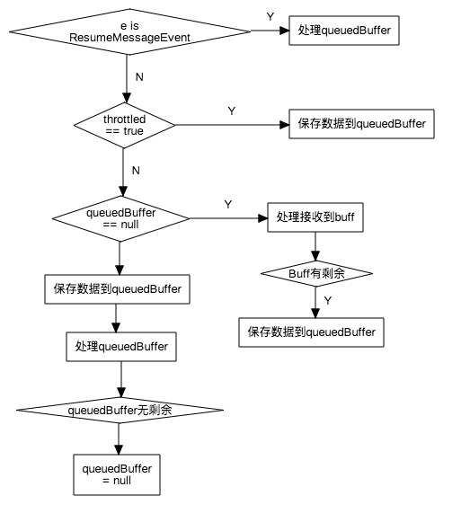
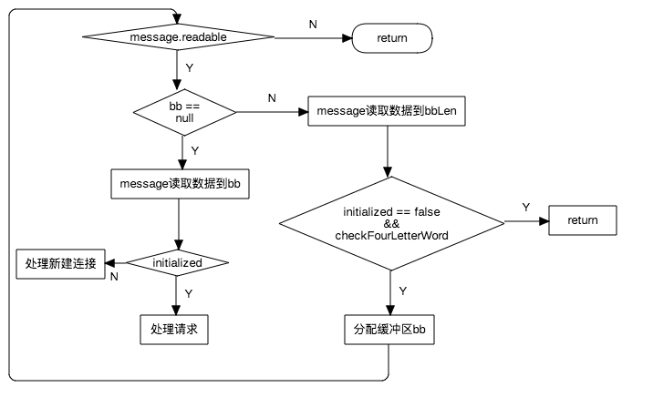

# 客户端连接管理

Zookeeper服务器管理客户端连接相关的类图如下:

用户可以配置两种连接，第一种是使用Java NIO接口，对应的类为NIOServerCnxn以及NIOServerCnxnFactory。第二种使用Netty库，对应的类为NettyServerCnxn和NettyServerCnxnFactory。

本文仅分析使用Netty库的实现。

## 1. 启动服务器
启动客户端连接服务器的入口为QuorumPeer.startServerCnxnFactory。服务器启动后，客户端的网络事件会回调到NettyServerCnxnFactory.CnxnChannelHandler。

## 2. 建立连接
有新的客户端连接，会调用NettyServerCnxnFactory.CnxnChannelHandler.channelConnected。该接口会新建NettyServerCnxn实例并保存。

## 3. 处理客户端数据
NettyServerCnxn包括一个变量throttled，表示是否处理用户发送的请求。例如若客户端的连接未建立完成，则不会处理客户端的请求。

### 3.1 接收客户端数据
当服务器接收到数据时，会调用NettyServerCnxnFactory.CnxnChannelHandler.processMessage接口。该接口的处理流程为

### 3.2 处理数据流程
处理数据接口为NettyServerCnxn.receiveMessage。有两个ByteBuffer用来保存客户端发送过来的数据。

* bbLen用于保存数据长度，或者判断请求是否是Command。对于普通的请求，前4个字节(Integer型长度)是请求数据长度；而对于Command，使用The Four Letter Words形式，即命令占用4个字节，正好是一个Integer型长度。bbLen默认为4Byte缓冲区。
* bb用户保存请求的数据，该缓冲区默认为null。

处理数据流程为:

### 3.3 返回数据
NettyServerCnxn.sendResponse返回结果给客户端。

### 3.4 Watch通知
zookeeper client可以监听数据的生命周期以及数据变化，client监听数据时，zookeeper会调用ZKdatabase.setWatches将ServerCnxn添加到监听列表。当有事件发生时，会调用ServerCnxn.process发送数据回client。
