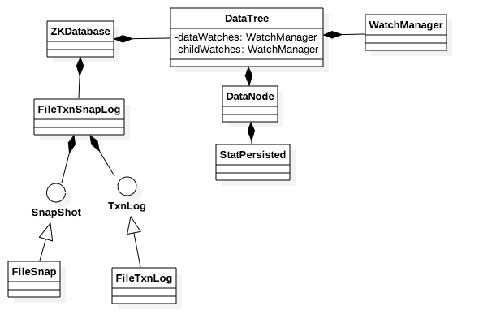

# 数据库格式
ZooKeeper数据库模块负责记录节点的数据信息，事务日志以及Snapshot日志，以及watch的管理，相关类图如下:


主要的类信息如下:

* ZKDatabase 数据库类的封装
* FileTxnSnapLog  日志类封装，包括事务日志和Snapshot日志的管理
* SnapShot为Shapshot日志接口，FileSnap为具体实现类。
* TxnLog为事务日志接口，FileTxnLog为具体实现类。
* DataTree为节点数据管理类，负责保存节点的数据以及管理数据的Watcher。
* DataNode保存节点的数据信息，状态信息以及子节点信息。

## 节点数据
ZooKeeper的节点类似Linux文件目录，根目录为/,每个目录有唯一的路径，同时，在节点上可以绑定用户指定的数据。

### 节点数据定义
节点的目录信息存储于DataTree.nodes信息中，为树形结构。

节点的状态信息存储于类StatPersisted，具体字段的含义如下:

```
private long czxid; 节点创建时的zxid
private long mzxid; 最后一次修改节点数据的zxid
private long ctime; 创建节点的时间
private long mtime; 最后一次修改节点数据的时间
private int version; 节点的版本号，创建时为0，修改时+1
private int cversion; 孩子节点版本信息，每创建一个孩子节点+1
private int aversion; ACL版本信息
private long ephemeralOwner; 节点的类型信息
private long pzxid;  节点本身和孩子节点的最后一次修改zxid。
```

### 节点类型定义
总共有四种类型的节点，具体定义为enum EphemeralType，每种类型的含义为:

* VOID 持久化的节点，用户连接关闭后节点会一直存在。
* NORMAL 临时节点，用户连接断开后临时节点会被删除。临时节点信息存储在DataTree.ephemerals中。
* CONTAINER 和VOID节点一样，但是当该节点的孩子被删除后，该节点会被删除。Container节点信息存储在DataTree.containers中。
* TTL 和VOID节点一样，但是当该节点无孩子节点，并且当前时间距离上次修改时间超过ttl时间，该节点会被删除。TTL节点信息存储在DataTree.ttls中。


### 特殊节点类型
ZooKeeper的节点有两个特殊的目录:

* /zookeeper/quota 配置某个节点的配额信息。
  * 如某个节点的路径为/xx/yy,则对应的配额信息路径为/zookeeper/quota/xx/yy，其中/zookeeper/quota/xx/yy/zookeeper_limits包含管理员设置的配额信息，/zookeeper/quota/xx/yy/zookeeper_stats包含节点当前已使用的信息。
  * 配额信息包含两个参数，分别表示大小(bytes)和节点数量(counts)。
  * 在创建节点时会更新配额的信息，并检查是否超过配额。
  * 配额的设置详见SetQuotaCommand.java。
* /zookeeper/config 未细看，暂时跳过。

### Watcher管理
有两种类型的Watcher

* childWatches 新增或者删除孩子节点时触发，可以在getChildren时注册。
* dataWatches 在创建，删除，修改时触发。

## 日志管理
### 事务日志
事务日志的文件格式如下所示:

文件头(16Byte)  |  事务列表 | 0补齐
--- | ---- | ---

文件头的格式为class FileHeader:

```
private int magic;   //字符串"ZKLG"
private int version; //默认为2
private long dbid;   
``` 

事务列表由多个事务组成，每个事务的格式如下:

校验和(8Bye) | 数据长度(4Byte) | 事务头信息(32Byte) | 请求数据 | 结束符(0x42)
----------- | -------------- | ---------------- | ------ | ----

事务头的格式为class TxnHeader:

```
private long clientId;
private int cxid;
private long zxid;
private long time;
private int type;
```

写事务的详细逻辑参见FileTxnLog.append,该函数会先检查日志文件是否存在，若不存在，则先创建文件，再写日志。每个日志文件的命名格式为log.该文件第一个日志的zxid。同时，并未发现有删除日志文件的地方，所以真正的部署环境需要有对应的删除日志的工具。

### Snapshot文件
Snapshot文件格式如下:

文件头(16Byte) | session信息 | 节点数据 
---- | ---- | ---

文件头格式和事务日志一样，只是Magic改成了“ZKSN”。

Session信息格式如下:

Count(4Byte) | 1-id(8Byte) | 1-Timeout(4Byte) | ... | N-id | N-Timeout 
--- | --- | --- | --- | --- | ---

节点数据

节点数据由类DataTree.serialize实现，该类会先序列化ACL信息，再按节点的树形结构序列化节点以及对应的状态信息，具体格式就不再叙述。

### 选举后同步数据流程
同步数据的流程在前面章节已经介绍过，但是跳过了同步数据的详细过程，下面分析一些同步数据的详细流程。

LeaderHandler.syncFollower里实现了生成同步数据请求的逻辑:

* ZKDatabase缓存了最后入库的请求队列缓存，记录了缓存里的最小事务id（minCommittedLog）以及最大事务id（maxCommittedLog）
* 若Follower的事务id和Leader一样，则发送Leader.DIFF，表示不需要同步数据
* 若Follower的事务id > Leader事务id，则发送Leader.TRUNC，截断Follower的数据，使其和Leader保持一致。
* 若minCommittedLog <= Follower事务id <= maxCommittedLog, 则从ZKDatabase缓存中获取请求，将需要同步的每条请求先发送一条Proposal，再发送一条Commit到Follower。
* 若Follower事务id < minCommittedLog, 则会从事务日志和ZKDatabase缓存中获取请求同步到Follower，每条请求也是先发送一条Proposal，再发送一条Commit。
* 如果指定需要同步Snapshot文件，则会直接发送snapshot文件到Follower。


