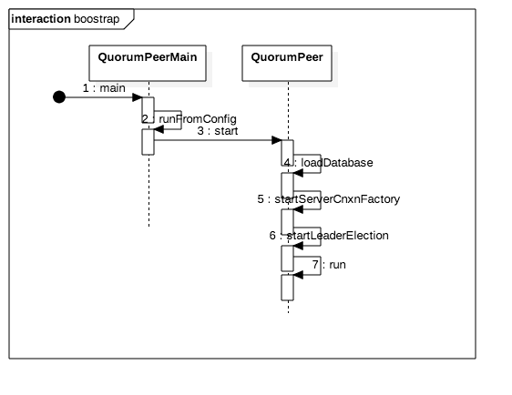
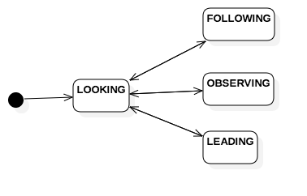
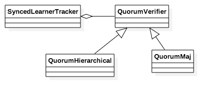
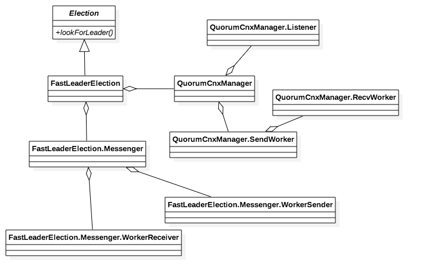
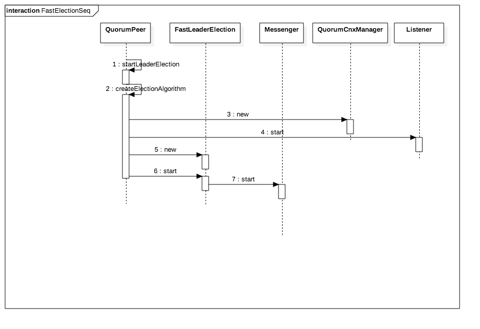
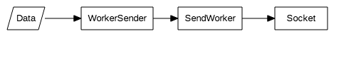
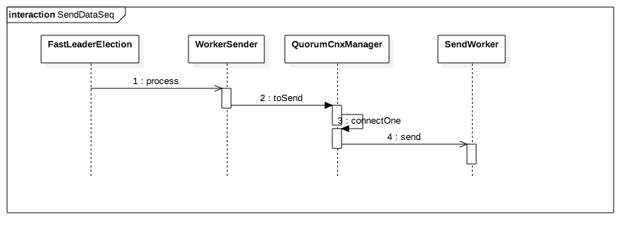
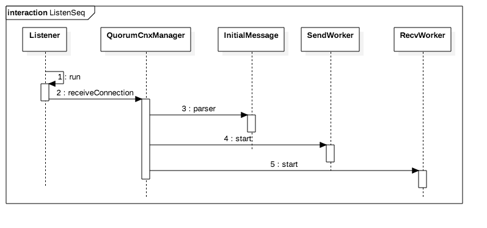
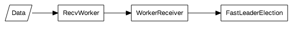
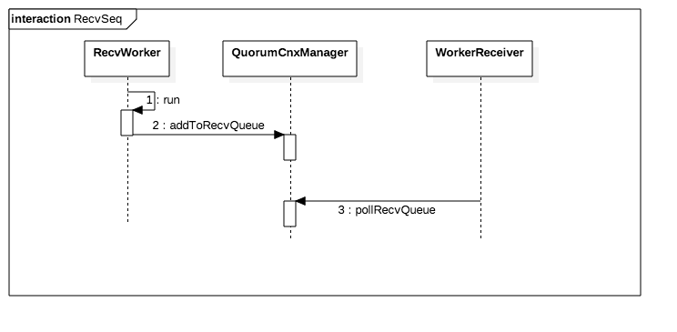

# ZooKeeper节点启动流程

## 1.启动流程

启动流程图如下图所示:



时序图中只显示主要的步骤，节点启动后

1. 载入当前节点的数据库
* 启动客户端连接监听
* 开始选举
* 启动QuorumPeer.run, 获取选取结果并执行响应的逻辑。

## 2.载入数据

## 3.启动客户端连接监听

服务器支持两种模式的连接监听模式，定义如QuorumPeer.java如下

```
ServerCnxnFactory cnxnFactory;
ServerCnxnFactory secureCnxnFactory;
```

第一种为不带安全连接的监听形式，第二种为带安全连接的监听形式。

ZooKeeper实现了两种ServerCnxnFactory, 分别是NioServerCnxnFactory和NettyServerCnxnFactory，启动时使用哪种实现可以在zookeeper.serverCnxnFactory属性中配置，若未配置，则默认使用NIOServerCnxnFactory，具体实现逻辑详见ServerCnxnFactory.createFactory函数。
客户端连接的管理会在后续章节介绍。

## 4. 选举
节点启动时，节点的状态初始化为ServerState.LOOKING，此时ZK会获取当前的Leader或者会发起一个选举。选举中节点的状态变化如下图所示:



ZooKeeper实现了四种选举模式。

1. LeaderElection 
2. AuthFastLeaderElection with authenticate disabled
3. AuthFastLeaderElection with authenticate enabled
4. FastLeaderElection

默认选用第四种选举方式。

### 4.1 相关类

想要了解选举算法的详细实现细节，就必须了解选举逻辑相关的基础类信息。选举相关的类如下:


QuorumVerifier用于检查一个服务器列表能否构成一个可用的服务器集群。主要接口如下:

* containsQuorum   选举的结果是否超过集群半数节点。
* getAllMembers    获取集群中所有的节点。
* getVotingMembers 获取集群中参与选举的节点。
* getObservingMembers 获取集群中Observer节点。

SyncedLearnerTracker用于保存集群和选举的映射关系。主要接口如下:

* addQuorumVerifier 添加集群信息
* addAck 添加选举响应
* hasAllQuorums 判断集群中参与选举的节点是否超过集群半数节点。

节点中维护了两个QuorumVerifier的实例，分别是QuorumPeer类中的如下两个:

* quorumVerifier   最后Commit的节点的Verifier
* lastSeenQuorumVerifier  最后Proposed节点的Verifier


### 4.2 FastLeaderElection

FastLeaderElection相关的类图如下所示:


Election为选举基类，lookForLeader会阻塞一直到成功获取Leader节点。

QuorumCnxManager负责选举中的连接管理，该类包含三个inner class。

* Listener 负责监接收新连接，并且管理连接，在单独的线程运行。
* SendWorker 负责发送数据到其他节点，所发送的数据由FastLeaderElection提供，在单独的线程运行。
* RecvWorker 负责从其他节点接收数据，并且将数据发送给FastLeaderElection，在单独的线程运行。

FastLeaderElection负责选举的算法处理，该类包含如下主要inner class。

* Messenger 发送和接收数据的管理类。注意，此处的发送和接收数据更关注的是打包和解包相关的逻辑，而不和网络相关，网络相关的部分由QuorumCnxManager负责。
* WorkerSender 负责打包选举数据，发送到其他节点，在单独的线程运行。
* WorkerReceiver 负责解析接收到数据，并根据结果反馈对应的ACK，在单独的线程运行。

#### 选举启动流程:


FastLeader启动后：

* 创建QuorumCnxManager实例，并且开始监听其他节点新建的连接。
* 创建FastLeaderElection实例，并且开启发送和接收数据的线程。（Messenger类会启动WorkerSender和WorkReceiver的线程）

#### 触发选举:
新启动节点的状态为LOOKING，在节点的主线程启动后（QuorumPeer.run调用后)，会调用Election的lookForLeader获取Leader信息。

发送数据到其他节点的数据流向为:


详细时序图如下所示：


如图所示，当FastLeaderElection要发送数据时，会通过向sendqueue发送数据来异步调用WorkerSender.process。在QuorumCnxManager.toSend的实现中，若到发送目标节点的连接不存在，则会主动建立连接。QuorumCnxManager通过加数据添加到发送列表来异步调用SendWorker.send。

在发送端建立连接时，首先会发送一个头信息，包括版本信息，当前节点的id，以及ip地址信息，详细信息详见QuorumCnxManager.initiateConnection。

接收方收到连接的时序图如下所示:


在接收端收到新连接时，首先会解析发送方发送的头信息。为了保证两个节点之间只有一个连接（即不会出现A建立连接到B，同时B也建立连接到A），zk会检查建立连接的节点的id。若发起连接的节点id小于当前节点，zk会断开这连接，并且主动建立一个到对方节点的连接。


接收数据的流向为:


详细时序图如下所示:


RecvWorker在收到数据库，调用addToRecvQueue将数据添加到队列，WorkerReceiver从队列取数据处理。WorkerReceiver处理逻辑如下:

* 检查对方节点是否参与选举，不参与选举的话直接返回当前的节点的结果。
* 若当前节点也在LOOKING状态，则将对方节点选举的结果添加到接收队列。若对方节点处于LOOKING状态，切状态落后于当前节点，则发送当前节点的选举信息到对方节点。
* 若当前节点处于选举成功状态(不是LOOKING状态)，则发送当前节点的选举结果到对方节点。


选举的详细流程如下，调用lookForLeader后，主要流程如下：

1- 载入当前节点的选举

```
synchronized(this){
    logicalclock.incrementAndGet();
    updateProposal(getInitId(), getInitLastLoggedZxid(), getPeerEpoch());
}
```

2- 向其他节点发送当前节点的选举信息。

```
   sendNotifications(); 
```

3- 收到其他节点反馈

从结果队列里面获取其他节点的选举结果。

若接收到的选举结果中状态为LOOKING，则检查当前节点的选举结果是否落后于收到的结果。若落后于收到的结果，则设置当前的选举结果为收到的结果，并广播给其他所有节点。再检查所有选举的列表，如果超过半数节点达成一致选举结果，则根据选中的结果设置当前节点状态为LEADING，FOLLOWING或OBSERVING。

若收到的选举结果中状态不是LOOKING，即其他节点已经选举完成，则检查是否超过半数节点选举结果一致；若一致，则设置当前节点的状态。

#### zxid以及ElectionEpoch

##### zxid
选举中会使用到数据库中最新的事务id(ZKDatabase.getDataTreeLastProcessedZxid()), 事务id由两部分组成，高32位表示Epoch，每次有新的节点当选会+1(Leader.lead())；后32位为事务id，有新的节点当选，该部分会从0重新开始。当数据库有写操作时，整个事务id会+1（参考ZooKeeperServer.getNextZxid()的引用）

##### ElectionEpoch

当前节点的ElectionEpoch定义于FastLeaderElection.logicalclock中，每发起一次新选举，该值会自+1。若其他节点选举信息中的ElectionEpoch大于当前节点，则会设置当前节点的值为接收到的值。

#### 总结
综上，若集群未选举出Leader，选举过程为:

1. 节点启动时，至少会向其他节点发送一次当前节点的选举信息，并接收一次其他节点的选举信息。
* 若自己节点的选举信息落后于收到的某个节点，则将当前节点的选举信息更新为收到的优先级最高的选举结果，并广播给所有其他节点。
* 重复上一步直至节点超过半数节点达成一致。

若节点加入时集群已经选举成功，过程为:

1. 节点启动时，至少会向其他节点发送一次当前节点的选举信息，其他节点返回已经达成一致的选举结果。
* 检查接收到的选举结果，如果超过半数节点结果一致，选举成功。
