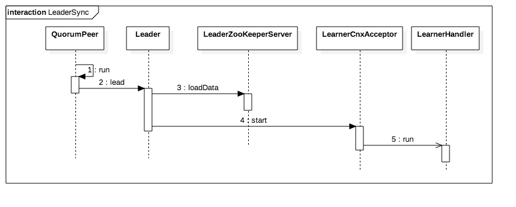
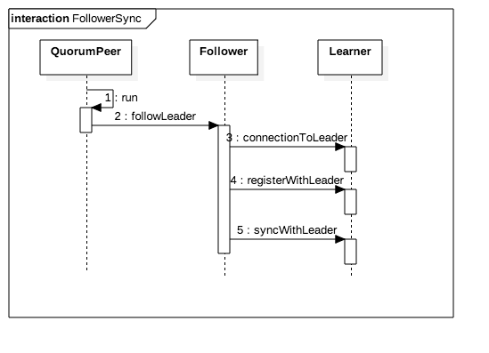
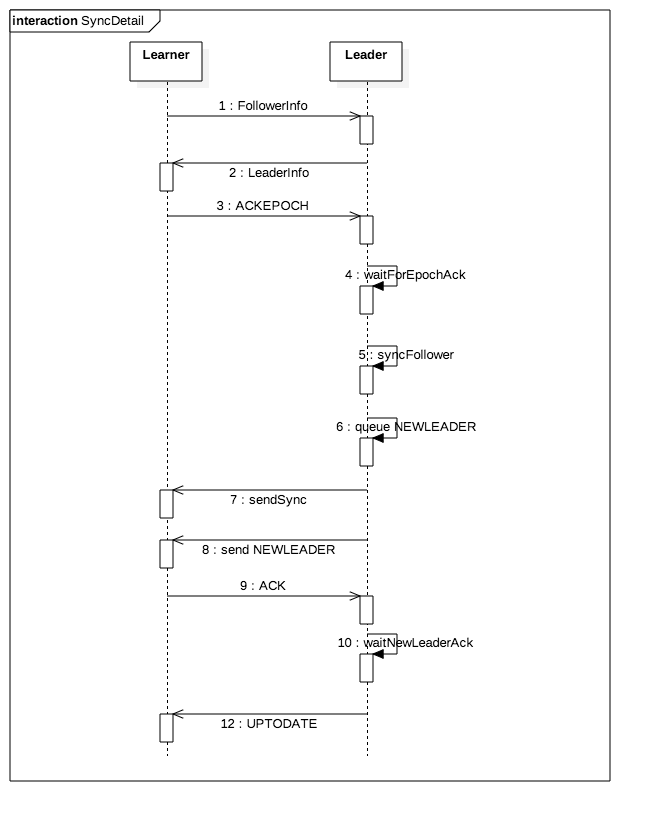

# 服务器状态同步

在节点选举完成后，就会进入FOLLOWING或LEADING状态。在其能对外提供服务之前，需要对各个服务器之间状态进行同步，使服务器的数据保持一致。

## 1. Leader同步数据
在Leader身份确定后，Leader执行的流程如下图所示:

在创建Leader对象时，会创建Leader监听的socket，在LeanerCnxAcceptor中会accept该连接，并且创建LearnerHandler的实例，该实例会新建线程，并处理和该新建的连接通信。

## 2. Follower同步数据
在Follower身份确定后，Follower执行的流程如下图所示:

## 3. 同步数据详细流程
以Follower节点为例介绍Learner节点和Leader同步。同步数据的相关类以及接口为上两节的时序图所示，具体的流程如下。

1. Follower节点在建立到Leader的连接后，立即发送FollowerInfo,数据中包括自身节点类型，zxid，协议号(0x10000)，以及节点ID(sid)。
* Leader回复LeaderInfo信息，信息包括zxid,以及版本号
* Follower回复ACKEPOCH,信息包括lastLoggedZxid，epoch信息。
* Leader等待超过半数节点回复的ACKEPOCH
* Leader会根据Follower发送的zxid信息，判断采用何种方式和Follower同步数据，并将同步数据的Request添加到队列。注意，此时消息并未发送，只是添加到队列。而具体的同步细节会在后续讲解操作日志以及Snapshot文件时讨论。
* 将NEWLEADER Request添加到队列。
* 发送队列的消息，因为同步数据的队列在前，NEWLEADER在后，所以会先和Follower同步数据，再发送NEWLEADER。
* Follower收到NEWLEADER后回复ACK。
* Leader 等待大部分节点回复ACK
* Leader 发送UPTODATE

在上述步骤完成后，集群状态已经稳定，可以对外提供服务。

