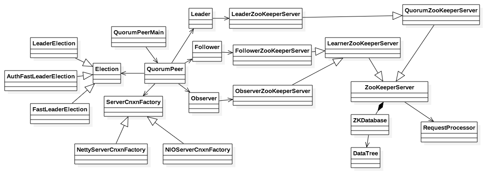
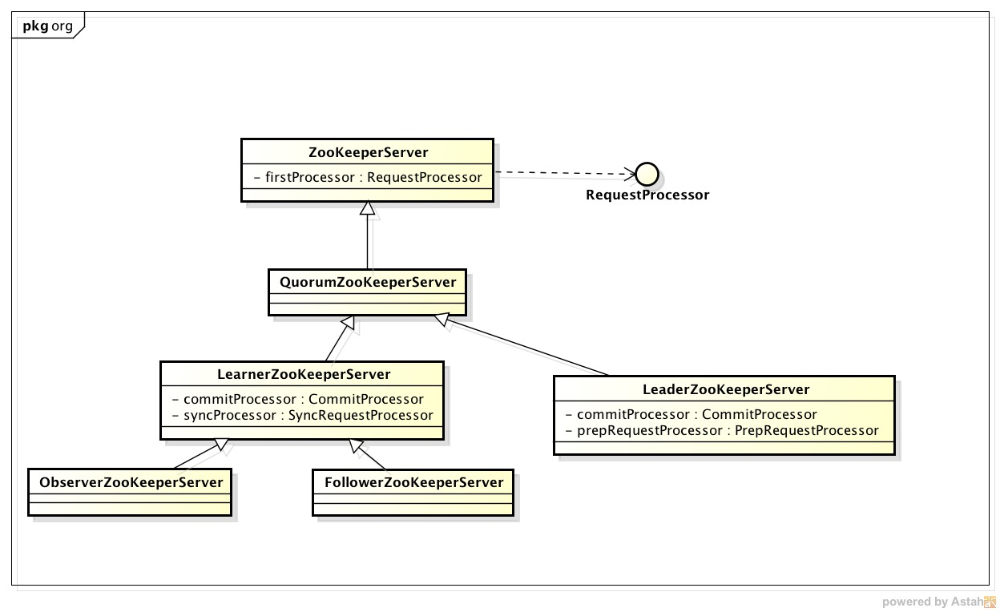
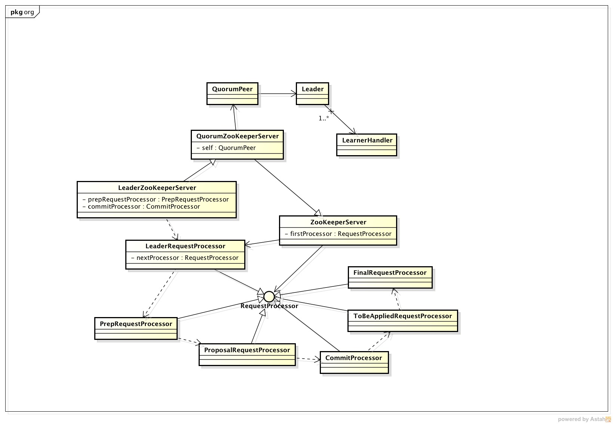
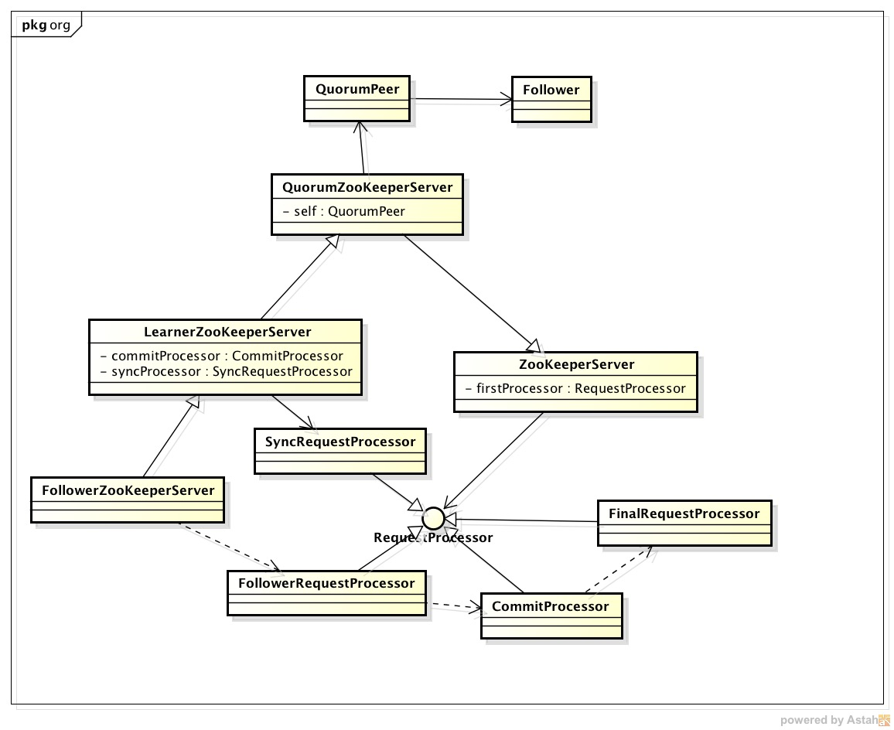

# ZooKeeper架构

## 1. 服务器节点

ZooKeeper节点架构定义如下：

1. QuorumPeerMain

   服务器启动的入口，按照用户的配置启动QuorumPeer
   
* QuorumPeer 

   代表每个节点，它会根据节点当前的身份来管理和启动对应的服务（如若是Leader，则运行Leader.lead），管理选举算法以及客户端连接。
   
* Election

  选举算法，QuorumPeer会根据配置选取合适的选举算法。
  
* ServerCnxnFactory

管理客户端的连接，QuorumPeer会根据配置选取合适的实现。

* ZooKeeperServer
服务器节点，根据不同的服务器节点类型有不同的实现。

* ZKDatabase
数据库，详细的数据保存在DataTree类中。

* RequestProcessor
客户端请求处理类，不同的ZooKeeper服务器会定义不同的处理类。

节点启动的具体实现细节会在剩下章节介绍。

## 2. 服务器节点类型

ZooKeeper定义了三种类型的节点:

1. Leader
*  Follower
*  Observer

其中，Leader和Follower参与新Leader的选举，Observer不参与选举。相关类图如下：

## 3. Leader节点
Leader节点负责对数据的写操作以及保证各个节点之间的数据的一致性，Leader相关的类图如下图所示:

Leader中主要包括如下几个类信息:

1. LeaderZooKeeperServer
   
   Leader节点对应的设置。
   
* Leader

   负责管理Leader相关逻辑的类。维护了一组LearnerHandler信息来处理和Learner的交互。
   
* LearnerHandler
  
  LearnerHandler用来处理Leader和Learner之间的交互，例如发送Packets到Learner，从Learner接收Packet并处理等。
  
* Processors

  Processor用来处理客户端的请求，Leader的firstProcessor为LeaderRequestProcessor的一个实例。处理Request使用的是职责链模式，Processor之间的虚线表示的是Request的处理流程。

## 4.Follower节点
Follower节点对外提供服务，同时参与选举Leader。Follower相关的类图如下图所示:

Follower中主要包含如下几个类的信息:

1. FollowerZooKeeperServer

   Follower节点对应的设置。

* Follower

  负责Follower相关逻辑的类，主要用于管理和Leader节点的交互，如PING，PROPOSAL，COMMIT等Request的处理等。
  
* Processors

  Follower的Processors主要用来处理来自客户端的请求，Follower的firstProcessor为FollowerRequestProcessor，也是职责链模式，流程处理由虚线表示。
  
  
## 5.Observer节点
//TODO

